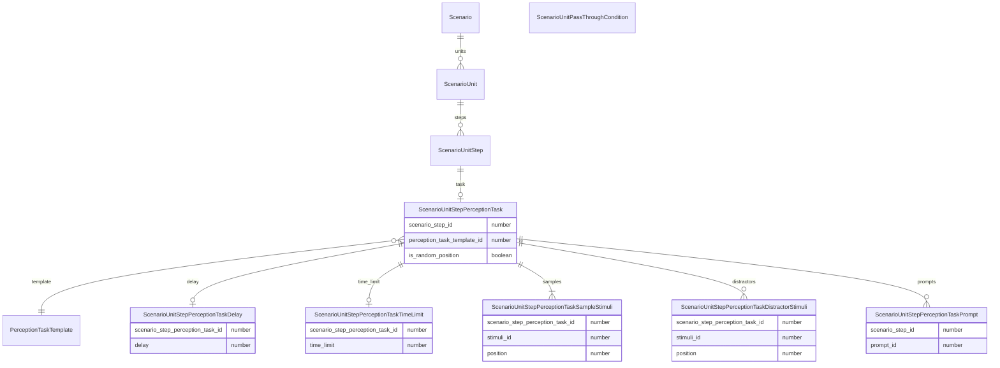

課題テンプレートはあくまで課題の設定を保持するものであり、課題の実施は課題テンプレートを元に行われる。
シナリオ生成の際に課題レコードを自力で作成するか、テンプレートベースで課題内容と刺激等の設定まで自動生成するかの違い
# 変数
 - シナリオ
   - シナリオユニット
     - 順序
     - シナリオユニットステップ
       - 順序
       - シナリオユニットステップ課題
           - 課題レイアウト
             - 固定、ランダム
             - スタンダードレイアウト
              - サンプル刺激行
                - サンプル刺激
                  - インデックス
                - インデックス
              - 比較刺激行
                - 比較刺激
                  - インデックス
                - インデックス
              - 固定、ランダム
              - スタンダード複数行レイアウト
                - サンプル刺激行
                  - サンプル刺激
                    - インデックス
                  - インデックス
                - 比較刺激行
                  - 比較刺激
                    - インデックス
                  - インデックス
                - 固定、ランダム
              - ランダムレイアウト
                - サンプル刺激リスト
                  - 刺激
                    - 座標(%,%)
                - 比較刺激リスト
                  - 刺激
                    - 座標(%,%)
                - ランダム、固定
              - 円形レイアウト
                - サンプル刺激リスト
                  - 刺激
                - 比較刺激リスト
                  - 刺激
                    - インデックス
                - 固定、ランダム
              - 行列レイアウト 
                  - サンプル刺激リスト
                    - 刺激
                      - 座標(x,y)
                  - 比較刺激リスト
                    - 刺激
                      - 座標(x,y)
                  - 列数
                  - 行数
                  - 固定、ランダム
          - 課題
          - 遅延
            - N秒後
          - 制限時間（タイミングの代替として使用）
            - N秒以内
          - キュー
          - プロンプト
            - 固定、自動
      - ユニットパススルー条件
        - 正解割合
- セッション
  - クライアントID
  - シナリオID
  - シナリオ（実施時の設定）
    - シナリオユニット
      - 順序
      - パススルー条件
      - シナリオユニットステップ
        - 順序
        - 課題レイアウト
          - スタンダード
            - サンプル刺激リスト
              - 刺激
              - 順序
            - 比較刺激リスト
              - 刺激
              - 順序
            - 選択した刺激リスト
              - 刺激
              - 順序
          - スタンダード複数行
            - サンプル刺激リスト
              - 刺激
              - 順序
            - 比較刺激リスト
              - 刺激
              - 順序
            - 選択した刺激リスト
          - ランダム
            - サンプル刺激リスト
              - 刺激
              - 座標
            - 比較刺激リスト
              - 刺激
              - 座標
            - 選択した刺激リスト
          - 円形
            - サンプル刺激リスト
              - 刺激
              - 順序
            - 比較刺激リスト
              - 刺激
              - 順序
            - 選択した刺激リスト
          - 行列
            - サンプル刺激リスト
              - 刺激
              - 座標
            - 比較刺激リスト
              - 刺激
              - 座標
            - 選択した刺激リスト
        - 課題
        - 遅延
        - 制限時間
        - キュー
        - プロンプト
 - ユーザー課題
   - ユーザーID
   - 課題説明
   - 具体例
   - サンプル刺激条件
     - 刺激のフォーマット
       - 画像
       - テキスト
       - 音声
   - 比較刺激条件
     - 刺激のフォーマット
       - 画像
       - テキスト
       - 音声
シナリオ＞ユニット＞ステップ＞課題＞レイアウト＞
マッチングタスク、分類タスク、比較（相対性）タスク、因果関係タスク、視点獲得タスク、論理推論タスク
マスターテーブル
- マッチング課題レイアウト
  - standard: 上部にサンプル刺激行、下部に比較刺激行
    - サンプル刺激と比較刺激、順番がわかればOK
  - standard_multiple_row: 上部にサンプル刺激行、下部に複数の比較刺激行
    - サンプル刺激と比較刺激、順番がわかればOK
  - random: 画面内の指定範囲にサンプル刺激、比較刺激をランダムに配置
    - サンプル刺激と比較刺激、座標がわかればOK
  - circle: サンプル刺激を中心として、比較刺激を円形に配置
    - サンプル刺激と比較刺激、順番がわかればOK
  - matrix: サンプル刺激、比較刺激を行列に配置
    - サンプル刺激と比較刺激、座標がわかればOK
 - マッチング課題カテゴリー
   - 認識スキル
   - 注意と集中力スキル
   - 記憶スキル
   - 言語とコミュニケーション
 - マッチング課題テンプレート
   - 認識スキル
     - 同じ色のアイテムを選択する 
     - 同じ形状のアイテムを選択する 
     - 同じサイズのアイテムを選択する 
     - 同じパターンのアイテムを選択する 
     - 同じテクスチャのアイテムを選択する 
     - 特定の色と形状を持つアイテムを選択する 
     - 特定の色とサイズを持つアイテムを選択する 
     - 特定の形状とパターンを持つアイテムを選択する 
     - 特定の色、形状、サイズを持つアイテムを選択する 
     - 特定の色、形状、パターンを持つアイテムを選択する
   - 注意と集中力
     - 1つのアイテムを選択する 
     - 2つのアイテムを順番に選択する 
     - 3つのアイテムを順番に選択する 
     - 刺激が複数ある中から特定のアイテムを選択する 
     - 一定時間（例えば10秒）内にできるだけ多くのマッチングを行う 
     - 一定の時間制限（例えば5秒）内に特定のアイテムを選択する 
     - より複雑な順序で複数のアイテムを選択する 
     - 選択すべきアイテムの数を増やして順番に選択する 
     - （短い時間間隔で提示される複数の刺激に反応する） 
     - （長い時間間隔で提示される複数の刺激に反応する）
   - 記憶力
     - 短い遅延（例えば2秒）で1つのアイテムを記憶する 
     - 中程度の遅延（例えば5秒）で1つのアイテムを記憶する 
     - 長い遅延（例えば10秒）で1つのアイテムを記憶する 
     - 短い遅延で2つのアイテムを記憶する 
     - 中程度の遅延で2つのアイテムを記憶する 
     - 長い遅延で2つのアイテムを記憶する 
     - 短い遅延で複数（3つ以上）のアイテムを記憶する 
     - 中程度の遅延で複数のアイテムを記憶する 
     - 長い遅延で複数のアイテムを記憶する 
     - 長い遅延と高度な混乱（多数のサンプル刺激の中から選ぶ）の下で複数のアイテムを記憶する
   - 言語とコミュニケーションスキル課題
     - 視覚的な刺激に対応する基本的な言葉を選択する 
     - 視覚的な刺激に対応する形状の言葉を選択する 
     - 視覚的な刺激に対応するサイズの言葉を選択する 
     - 複数の視覚的な刺激に対応する複数の言葉を選択する 
     - 視覚的な刺激に対応する語句を選択する 
     - 視覚的な刺激に対応する短い文を選択する 
     - 視覚的な刺激に対応する長い文を選択する 
     - 視覚的な刺激に対応する短い物語を選択する 
     - 視覚的な刺激に対応する長い物語を選択する 
     - 視覚的な刺激に対応する複雑な語彙や表現を選択する
